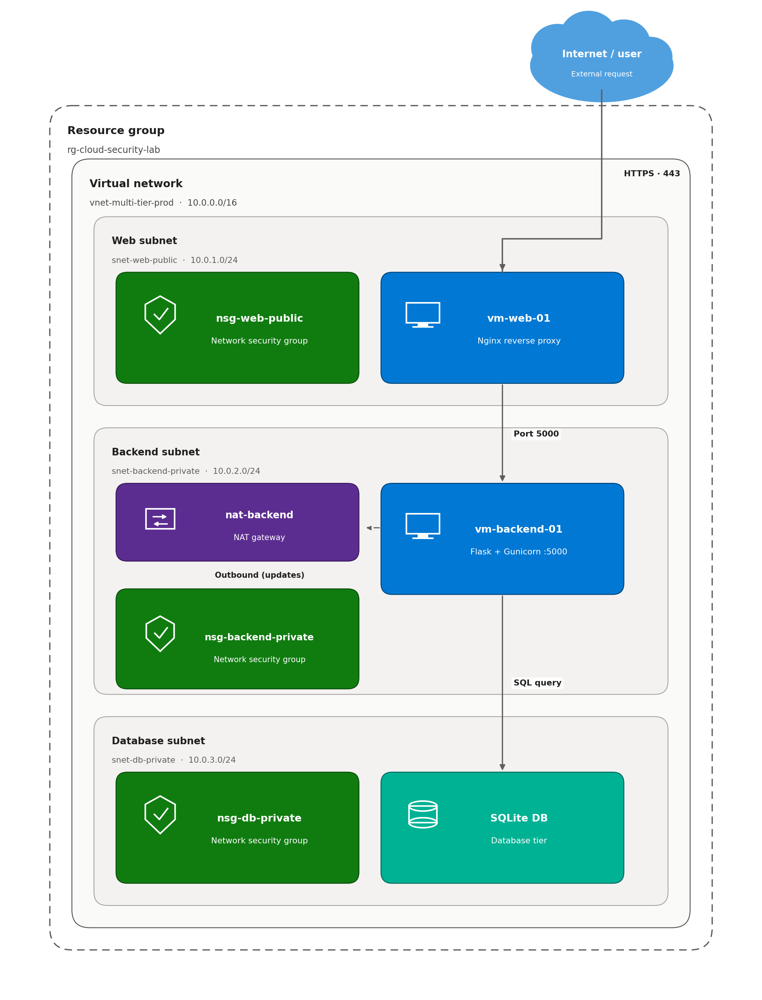
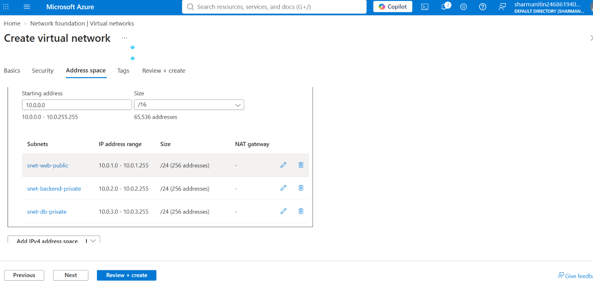
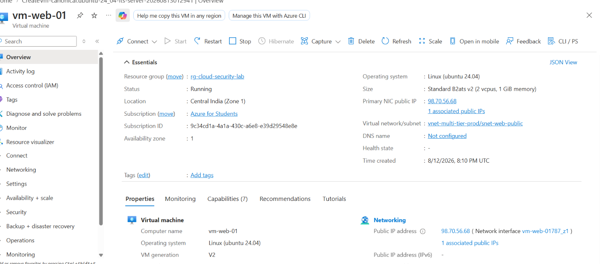
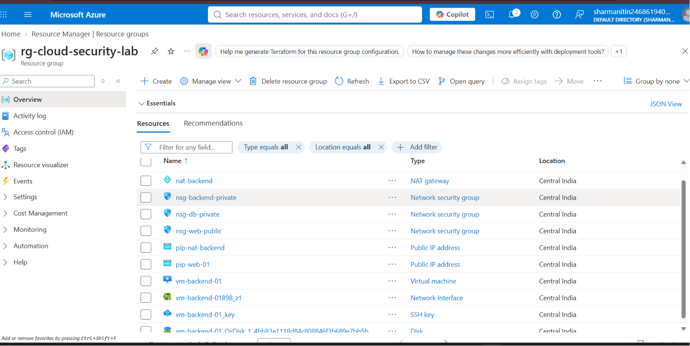
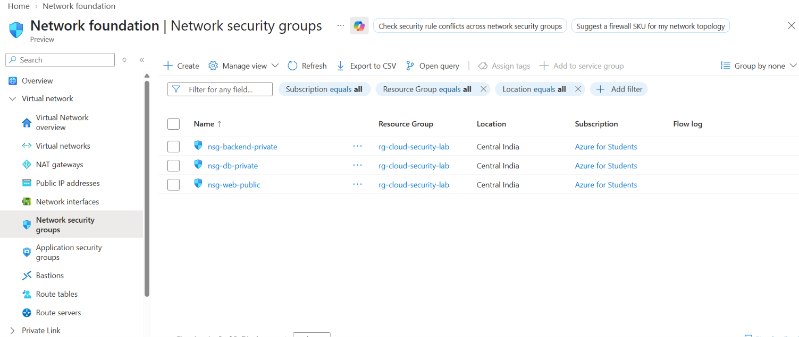
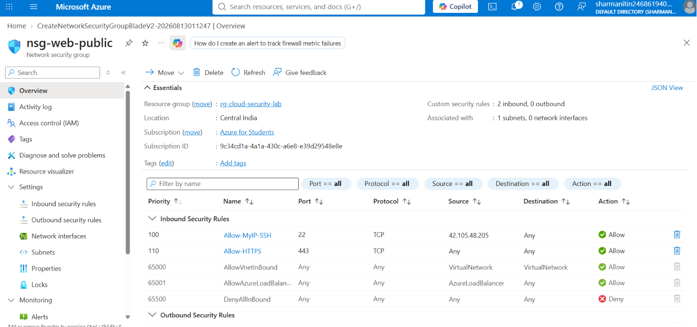
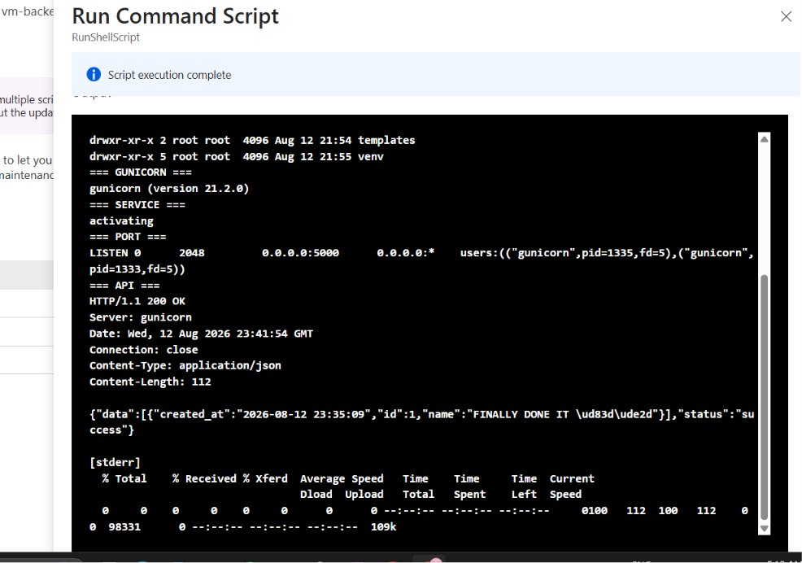
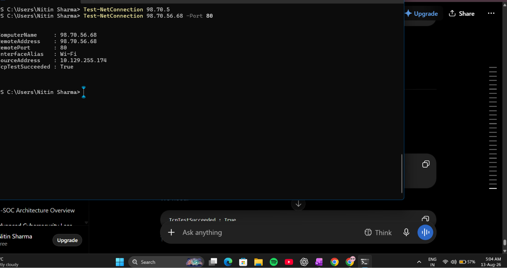
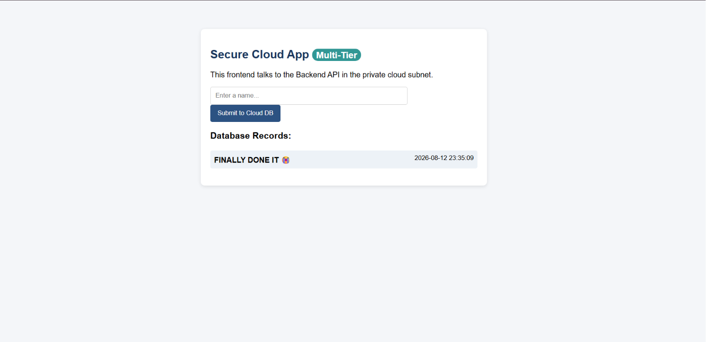

# 📷 Infrastructure & Verification Screenshots

This directory contains visual proof of deployment, configuration, and end-to-end testing for the multi-tier Azure infrastructure lab.

---

## 🗺️ Architecture Overview

---

## 🌐 1. Network & Subnet Setup

### Virtual Network & Subnets
Configuration showing the VNet address space (`10.0.0.0/16`) divided into public, backend-private, and database subnets.

---

## 🖥️ 2. Compute Resources & Resource Group Inventory

### Public Web VM (`vm-web-01`)
Overview blade showing running status, public IP assignment, and subnet association.

### Resource Group Inventory (`rg-cloud-security-lab`)
Complete resource group view displaying all provisioned Azure assets (NAT Gateway, Disks, NICs, and VMs).

---

## 🛡️ 3. Network Security Groups (NSG)

### All Security Groups Summary
List of all Network Security Groups controlling tier isolation (`nsg-web-public`, `nsg-backend-private`, `nsg-db-private`).

### Web Tier Inbound Rules
Inbound security rules enforcing SSH restricted to administrative IP and allowing public HTTPS traffic.

---

## 🧪 4. Testing & Verification

### Backend API Local Test
Verification using Azure Run Command showing Gunicorn active and Flask API responding locally on port 5000 (`200 OK`).

### Inter-Tier Network Connectivity Test
PowerShell `Test-NetConnection` verifying successful TCP reachability between tiers over private networking.

### Final Live Application UI
Frontend web application rendering live data queried from the private backend tier and database.

